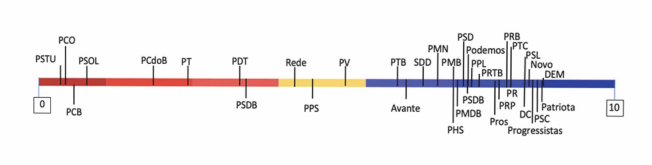

```{r setup, include=FALSE, echo=FALSE, warning=FALSE}
pacman::p_load(tidyverse, readr, readxl, lubridate, dplyr, foreign, janitor, magrittr)

setwd("~/metodos_quantitativos_listas/Trabalho-Final-")

processos_concentrado <- read_excel("processos_concentrado.xlsx") %>% 
  janitor::clean_names() %>% 
  select(processo, relator_atual, data_autuacao) %>% rename(relator = relator_atual,
                                                            data_ajuizamento = data_autuacao)
                                                      

View(processos_concentrado)

requerentes <- read_excel("requerentes.xlsx") %>% 
  janitor::clean_names() %>% select(-legitimado_polo_passivo) %>%
  rename(requerente = legitimado_polo_ativo)   

View(requerentes)

processos_concentrado <- processos_concentrado %>% left_join(requerentes) %>% 
  distinct()   

View(processos_concentrado)

processos_concentrado <- processos_concentrado %>% 
  mutate (requerente_perfil = case_when(str_detect(requerente, 
                                                   regex("PARTIDO|DEMOCRATA|REDE|PODEMOS|SOLIDARIEDADE|UNIÃO_BRASIL|CIDADANIA")) 
                                        ~ "Partido político", str_detect(requerente, regex("ESTADO|DISTRITO")) 
                                        ~ "Governador de Estado ou do Distrito Federal", str_detect(requerente, regex("ORDEM"))
                                        ~"OAB", str_detect(requerente, regex("PROCURADOR|PROCURADORA|PROCURADORIA")) 
                                        ~ "Procurador-Geral da República", str_detect(requerente, regex("ASSOCIAÇÃO|ASSOCIACAO|ESCRITORIO|ESCRITÓRIO|ALIANCA|ARTICULACAO|ARTICULAÇÃO|INSTITUTO"))
                                        ~"Confederação sindical ou entidade de classe", str_detect(requerente, 
                                                                                                   regex("CONFEDERAÇÃO|CONFEDERACAO|FEDERAÇÃO|FEDERACAO|UNIDAS|CENTRAL|SINDICATO"))
                                        ~ "Confederação sindical ou entidade de classe", str_detect(requerente, regex("CÂMARA|CAMARA|SENADO|CONGRESSO NACIONAL"))
                                        ~ "Poder Legislativo", str_detect(requerente, regex("PRESIDENTE DA REPÚBLICA"))
                                        ~ "Presidente da República")) 

partidos <- processos_concentrado %>%
  filter(requerente_perfil %in% c("Partido político", "Presidente da República"))

View(partidos)

presidentes <- partidos %>% filter(requerente_perfil == "Presidente da República") %>% 
  mutate(ano_ajuizamento = year(data_ajuizamento)) %>% 
  select(processo, relator, ano_ajuizamento, requerente) %>% 
  mutate(Presidente_requerente = case_when(str_detect(ano_ajuizamento,"1995|1996|1997|1998") ~ "FHC 1", 
                                           str_detect(ano_ajuizamento,"1999|2000|2001|2002") ~ "FHC 2",
                                           str_detect(ano_ajuizamento,"2003|2004|2005|2006") ~ "Lula 1",  
                                           str_detect(ano_ajuizamento,"2007|2008|2009|2010") ~ "Lula 2",
                                           str_detect(ano_ajuizamento,"2011|2012|2013|2014") ~ "Dilma 1", 
                                           str_detect(ano_ajuizamento,"2015|2016") ~ "Dilma 2",
                                           str_detect(ano_ajuizamento,"2017|2018") ~ "Temer", 
                                           str_detect(ano_ajuizamento,"2019|2020|2021|2022") ~ "Bolsonaro",
                                           str_detect(ano_ajuizamento,"2023|2024") ~ "Lula 3"))

presidentes <- presidentes %>% select(-requerente) %>% rename(requerente = Presidente_requerente)

View(presidentes)

partidos <- partidos %>% filter(requerente_perfil == "Partido político") %>% 
  select(-requerente_perfil) %>% 
  mutate(ano_ajuizamento = year(data_ajuizamento)) %>% 
  select(processo, relator, ano_ajuizamento, requerente)         

partidos_presidentes <- rbind(presidentes, partidos)

View(partidos_presidentes)

partidos_presidentes <- partidos_presidentes %>%  
  mutate(Presidente_ajuizamento = case_when(str_detect(ano_ajuizamento,"1988|1989") ~ "Sarney",
                                            str_detect(ano_ajuizamento,"1990|1991|1992") ~ "Collor",
                                            str_detect(ano_ajuizamento,"1993|1994") ~ "Itamar", 
                                            str_detect(ano_ajuizamento,"1995|1996|1997|1998") ~ "FHC 1", 
                                            str_detect(ano_ajuizamento,"1999|2000|2001|2002") ~ "FHC 2",
                                            str_detect(ano_ajuizamento,"2003|2004|2005|2006") ~ "Lula 1",  
                                            str_detect(ano_ajuizamento,"2007|2008|2009|2010") ~ "Lula 2",
                                            str_detect(ano_ajuizamento,"2011|2012|2013|2014") ~ "Dilma 1", 
                                            str_detect(ano_ajuizamento,"2015|2016") ~ "Dilma 2",
                                            str_detect(ano_ajuizamento,"2017|2018") ~ "Temer", 
                                            str_detect(ano_ajuizamento,"2019|2020|2021|2022") ~ "Bolsonaro",
                                            str_detect(ano_ajuizamento,"2023|2024") ~ "Lula 3"))

coalizoes <- read.csv2("coalizoes.csv")

View(coalizoes)

coalizoes <- coalizoes %>% select(Presidente, Partidos_coalizao) 

partidos_presidentes <- partidos_presidentes %>%
  mutate(governo_oposicao = 
           case_when(str_detect(requerente, 
                                regex("FHC|Lula|Dilma|Bolsonaro|Temer", 
                                      ignore.case =TRUE)) ~"Governo", 
                     (str_detect(requerente, 
                                regex("PMDB|PFL", 
                                      ignore.case =TRUE)) & 
                        str_detect(Presidente_ajuizamento, regex("Sarney", ignore.case = TRUE))) ~"Governo",
                     (str_detect(requerente, 
                                 regex("PRN|PFL|PDS|PTB|PL", 
                                       ignore.case =TRUE)) & 
                        str_detect(Presidente_ajuizamento, regex("Collor", ignore.case = TRUE))) ~"Governo",
                     (str_detect(requerente, 
                                 regex("PFL|PTB|PMDB|PSDB|PSB|PP", 
                                       ignore.case =TRUE)) & 
                        str_detect(Presidente_ajuizamento, regex("Itamar", ignore.case = TRUE))) ~"Governo",
                     (str_detect(requerente, 
                                 regex("PSDB|PFL|PMDB|PTB|PPB", 
                                       ignore.case =TRUE)) & 
                        str_detect(Presidente_ajuizamento, regex("FHC 1", ignore.case = TRUE))) ~"Governo",
                     (str_detect(requerente, 
                                 regex("PSDB|PFL|PMDB|PPB", 
                                       ignore.case =TRUE)) & 
                        str_detect(Presidente_ajuizamento, regex("FHC 2", ignore.case = TRUE))) ~"Governo",
                     (str_detect(requerente, 
                                 regex("PT|PL|PCdoB|PC DO B|PSB|PTB|PDT|PPS|PV|PMDB|PARTIDO TRABALHISTA BRASILEIRO", 
                                       ignore.case =TRUE)) & 
                        str_detect(Presidente_ajuizamento, regex("Lula 1", ignore.case = TRUE))) ~"Governo",
                     (str_detect(requerente, 
                                 regex("PT|PR|PCdoB|PC DO B|PSB|PTB|PMDB|PP|PDT|PRB|PARTIDO DO MOVIMENTO DEMOCRÁTICO BRASILEIRO", 
                                       ignore.case =TRUE)) & 
                        str_detect(Presidente_ajuizamento, regex("Lula 2", ignore.case = TRUE))) ~"Governo",
                     (str_detect(requerente, 
                                 regex("PT|PR|PCdoB|PSB|PMDB|PP|PDT|PRB|PARTIDO DOS TRABALHADORES", 
                                       ignore.case =TRUE)) & 
                        str_detect(Presidente_ajuizamento, regex("Dilma 1", ignore.case = TRUE))) ~"Governo",
                     (str_detect(requerente, 
                                 regex("PT|PMDB|PDT|PCdoB|PC DO B|PR|PP|PSD|PTB|PARTIDO DOS TRABALHADORES", 
                                       ignore.case =TRUE)) & 
                        str_detect(Presidente_ajuizamento, regex("Dilma 2", ignore.case = TRUE))) ~"Governo",
                     (str_detect(requerente, 
                                 regex("PMDB|PSDB|PR|PRB|PSD|PTB|DEM|Democratas|PPS|PP", 
                                       ignore.case =TRUE)) & 
                        str_detect(Presidente_ajuizamento, regex("Temer", ignore.case = TRUE))) ~"Governo",
                     (str_detect(requerente, 
                                 regex("PSL", 
                                       ignore.case =TRUE)) & 
                        str_detect(Presidente_ajuizamento, regex("Bolsonaro", ignore.case = TRUE))) ~ "Governo",
                     (str_detect(requerente, 
                                 regex("PT|União Brasil|PSD|PSB|MDB|Rede|PSol|P-Sol|PDT|PCdoB|PC DO B|PARTIDO COMUNISTA DO BRASIL|PARTIDO DOS TRABALHADORES|PARTIDO SOCIALISMO E LIBERDADE|REDE SUSTENTABILIDADE|PARTIDO DEMOCRATICO TRABALHISTA", 
                                       ignore.case =TRUE)) & 
                        str_detect(Presidente_ajuizamento, regex("Lula 3", ignore.case = TRUE))) ~"Governo"))


partidos_presidentes$governo_oposicao <- partidos_presidentes$governo_oposicao %>% replace_na("Oposição")

View(partidos_presidentes)

Sumario_ajuizamento <- partidos_presidentes %>% group_by(governo_oposicao) %>% 
  summarise(n = n())

View(Sumario_ajuizamento)  

Sumario_ajuizamento <- Sumario_ajuizamento %>% mutate(Prop = n/2131*100)

Sumario_ajuizamento <- Sumario_ajuizamento %>% 
  rename(Posicionamento = governo_oposicao, Número = n, Proporção = Prop)

Sumario_ajuizamento2 <- partidos_presidentes %>% group_by(governo_oposicao) %>% 
  summarise(n = n())

View(Sumario_ajuizamento2)

Sumario_presidente <- partidos_presidentes %>% group_by(Presidente_ajuizamento, governo_oposicao) %>%
  summarise(n=n())

View(Sumario_presidente)

Sumario_presidente <- Sumario_presidente %>% 
  pivot_wider(names_from = governo_oposicao, values_from = n) %>%
  rename(Presidente = Presidente_ajuizamento) %>% mutate_all(replace_na,0)

```

## Resumo 

(i) Considerando o peculiar desenho institucional brasileiro, que atribui ao Presidente da República e aos partidos políticos a legitimidade para a propositura de ações de controle concentrado de constitucionalidade (ADI/ADC/ADPF), o presente trabalho se propõe a verificar se o exercício da jurisdição constitucional pelo Supremo Tribunal Federal espelharia, mesmo que parcialmente, a disputa político-partidária ocorrida no âmbito do Congresso Nacional.

(ii) Para tanto, foram extraídos, do Programa Corte Aberta do Supremo Tribunal, dados acerca de todas as ações de controle concentrado de constitucionalidade ajuizadas pelos Presidentes da República e pelos partidos políticos desde a promulgação da Constituição de 1988.

(iii) Após a organização e reestrutação dos dados coletados, foi possível concluir que (a) os partidos políticos da Oposição utilizam-se da jurisdição constitucional com muito maior intensidade que os partidos políticos da Coalizão de Governo;(b) contudo, os partidos políticos que, no momento em que prolatada a decisão judicial, compõem a Coalizão de possuem maior probabilidade de êxito em suas postulações. 

(iv) Foi possível aferir também que a maior parte das ações de controle concentrado ajuizadas desde a Constituição de 1988 por partidos políticos foi ajuizada por partidos ideologicamente classificados como de Esquerda.

(v) Por fim, constatou-se que não há diferença estatisticamente significante no posicionamento ideológico de Ministros apontados por Presidentes de Direita ou de Esquerda, considerando as decisões proferidas por esses Ministros no âmbito de ações de controle concentrado de constitucionalidade ajuizadas por partidos políticos. 

## Introdução

A Constituição de 1988 conferiu à jurisdição constitucional brasileira um desenho peculiar. Além de amalgamar dois sistemas oriundos de tradições jurídicas diversas (o denominado controle difuso de constitucionalidade, de matriz estadunidense, e o controle concentrado de constitucionalidade, predominante na maioria dos países da Europa Continental), o caráter analítico de nossa Lei Fundamental e o grande número de legitimados ao ajuizamento de ações de controle concentrado de constitucionalidade fizeram com que o Supremo Tribunal Federal - de forma gradual e crescente - passasse a ser um *locus* privilegaiado para a definição de questões de alta densidade política e de enome relevãncia social. 

Nesse desenho institucional peculiar, sobressai a legitimidade conferida ao Presidente da República e aos partidos políticos para provocar diretamente a atuação da Suprema Corte na análise da constitucionalidade de leis e de outros atos normativos. 

Nesse contexto institucional, constata-se a efetiva utilização dessa nova arena  pelo Chefe do Poder Executivo e principalmente pelos partidos políticos para (i) a resolução de questões impopulares, (ii) para a obtenção de “voz”, principalmente pelos partidos minoritários, (iii) para a devida exposição das razões das ações governamentais ou por outras razões que conduzam as lideranças, os partidos e os movimentos políticos a buscarem o Poder Judiciário para a efetivação de seus objetivos e interesses políticos (BÓGEA, 2021; RÍOS-FIGUEROA, 2016; CARRUBA E GABEL, 2014; WHITTINGTON, 2007; CARRUBA, 2005). 

Assim, o presente estudo tem por objetivo aferir quais os influxos da disputa político-partidária sobre o exercício da jurisdição constitucional pelo Supremo Tribunal Federal. Em síntese, busca-se averiguar se e como a jurisdição constitucional espelha, mesmo que parcialmente. as dinâmicas inerentes às disputas entre os partidos políticos e entre os partidos políticos e o Governo federal. 

Para tanto, procura-se, a partir de dados extraídos do [Programa Corte Aberta do Supremo Tribunal Federal](https://transparencia.stf.jus.br/extensions/corte_aberta/corte_aberta.htm) e do sítio eletrônico do [Banco de Dados Legislativos do CEBRAP](https://bancodedadoslegislativos.com.br/index.php), verificar se as ações de controle concentrado de constitucionalidade seriam instrumentos utilizados precipuamente pelos partidos políticos que compõem a Coalizão de Governo ou pelos partidos políticos da Oposição e se as ações de controle concentrado de constitucionalidade ajuizadas por partidos políticos que compõem, no momento em que a decisão judicial é prolatada, a Coalização de Governo possuiriam maior probabilidade de êxito.

Em outro giro, objetiva-se, ainda, verificar se há uma diferença significtaiva entre as ações de controle concentrado ajuizadas por partidos políticos classificados ideologicamente como de Direita e as ações ajuizadas pelos partidos políticos classificados ideologicamente como de Esquerda. 

Por fim, busca-se aferir se Ministros do Supremo Tribunal Federal indicados por Presidentes da República classificados ideologicamente como de Esquerda ou de Direita teriam maior propensão de decidir favoravelmente a partidos políticos que gravitam no mesmo campo ideológico.

Não há dúvida de que, considerando a proeminência alcançada pelo Supremo Tribunal Federal na definição e na efetivação do desenho institucional esboçado pela Constituição de 1988, acabando por se imiscuir em searas até então compreendidas como eminentemente políticas, afigura-se relevante - e mesmo necessária - a análise das consonâncias e dissonâncias entre a disputa político-partidária ocorrida no âmbito do Congresso Nacional e a disputa política travada em outras arenas, em especial no Supremo Tribunal Federal, órgão de cúpula do Poder Judiciário nacional e Corte Constitucional. 

## Metodologia 

Conforme mencionado, os dados foram extraídos do [Programa Corte Aberta do Supremo Tribunal Federal](https://transparencia.stf.jus.br/extensions/corte_aberta/corte_aberta.html) e do sítio eletrônico do [Banco de Dados Legislativos do CEBRAP](https://bancodedadoslegislativos.com.br/index.php).

As informações extraídas dos mencionados repositórios foram  trabalhadas e combinadas com a finalidade de se obter a listagem de todas as ações de controle concentrado de constitucionalidade (ADI/ADC e ADPF) ajuizadas, desde a promulgação da Constituição de 1988, pelos Presidentes da República e pelos partidos políticos. Os partidos políticos foram classificados como pertecentes à Coalizão de Governo ou à Oposição.  

Com a exclusiva finalidade de facilitar as análises realizadas, todos os partidos que, em algum momento do mandato presidencial, fizeram parte da Coalizão de Governo, foram classificados como "Governo" e os demais como "Oposição". 

```{r, echo=FALSE, message=FALSE, warning=FALSE}
knitr::kable(coalizoes)
```

Os partidos políticos também foram classificados ideologicamente com base na classificação sugerida por Bolognesi, Ribeiro, Coldato, 2023. Importante ressaltar, contudo, que, tendo em vista a inexistência de Ministros do Supremo Tribunal Federal indicados por Presidentes ideologicamente classificados como de Centro, decidiu-se por uma divisão binária ou bipartite (Direita-Esquerda), utilizando-se a mediana da distribuição. Desse modo, REDE, PPS e PV foram classificados como partidos de Esquerda.

```{r, echo=FALSE, warning=FALSE, message=FALSE}

```

Cumpre registrar que a divisão tricotômica dos partidos políticos (Direita-Centro-Esquerda) também foi testada, com resultados equivalentes. Portanto, a fim de facilitar a análise e a interpretação dos resultados, optou-se pela divisão em dois grupos apenas.   
 
Com base nesses dados, foi criado um *proxy* para a mensuração do posicionamneto ideológico dos Ministros do Supremo Tribunal Federal, consistente na diferença entre o número de decisões proferidas em processos de controle concentrado de constitucionalidade (ADC/ADI/ADPF) favoráveis a partidos políticos de Esquerda e o número de decisões favoráveis a partidos políticos de Direita. 

Tendo em vista que o número de processos ajuizados pelos partidos de Direita é menor do que o número de processos ajuizados por partidos de Esquerda (786 e 1341), foi atribuído o peso de 1,7 às decisões proferidas nos processos ajuizados pelos partidos de Direita. A fim de evitar valores negativos, a cada um dos valores foi adicionado 50 unidades. Desse modo, valores acima de 50 revelam posicionamento ideológico à Esquerda e valores abaixo de 50, posicionamento ideológico à Direita.

Faz-se necessária, contudo, um aressalva: foram computadas tanto decisões monocráticas quanto colegiadas. Em relação às decisões colegiadas, sabe-se que nem sempre o relator do processo profere o voto vencedor, o denominado voto-condutor do acórdão. Todavia, tendo em vista que, na grande maioria dos casos, o relator é o autor do entendimento jurídico que sagra o prevalecente, além de ser aquele que tem o maior contato com o processo, sendo, incluisve o responsável pela sua instrução, optou-se também, por razões de simplificação metodológica, por atribuir sempre ao relator a decisão proferida, seja ela monocrática ou colegiada.   

Nesse sentido, a cada um dos Ministro da Suprema Corte foi atribuída uma pontuação (número de decisões favoráveis à partidos de Esquerda - 1,7*número de decisões proferidas por partidos de Direita)

Importante salientar que adoção do referido *proxy* não revela pretensões teóricas de maior relevo (como, por exemplo, Martin e Quinn, 2002), afigurando-se apenas como um artíficio para a aferição da existência de relação causal entre o ideologia do partido político que ajuizou a ação de controle concentrado de constitucionalidade e a decisão proferida por determinado Ministro da Suprema Corte.   

Nesse sentido, seguindo  proposta de mensuração da ideologia judicial sugerida por Segal e Spaeth (2002), segundo a qual a ideologia dos magistrados das Cortes Superiores pode ser estimada a partir da ideologia da autoridade pública responsável pela sua indicação, todos os Ministros que atuaram na Corte Suprema desde a promulgação da Constituição de 1988 foram ideologicamente classificados a partir da ideologia professada pelo Presidente da República que os indicou. 

A partir dessa classificação, foram criados dois grupos: Ministros de Direita e Ministros de Esquerda.

Decidiu-se então por testar se existiria uma diferença estatisticamente significante entre as médias das pontuações atribuídas a cada um dos grupos. Ou seja, se os Mnistros apontados por Presidentes de Direita ou de Esquerda tenderiam a exarar um número maior de decisões favoráveis a partidos que estivessem no mesmo campo ideológico do que àqueles que estivessem em campo ideológico diverso. 

Tendo em vista a existência de duas amostras independentes ("decisões proferidas por Ministros do STF indicados por Presidentes classificados ideologicamente como de esquerda"  e "decisões proferidas por Ministros do STF indicados por Presidentes classificados ideologicamente como de direita") e considerando que essas amostras apresentam variâncias homogêneas (Teste de Levene), optou-se pelo "Teste-t para amostras independentes com variâncias iguais".

Eis as hipóteses a serem testadas: 

**Hipótese nula (H0)**: a média dos "posicionamentos ideológicos" dos Ministros do STF indicados por Presidentes da República classificados ideologicamente como de Direita **não** diverge da média dos "posicionamentos ideológicos" dos Ministros do STF indicados por Presidentes da República ideologicamente classificados como de Esquerda. 

**Hipótese alternativa (HA)**: a média dos "posicionamentos ideológicos" dos Ministros do STF indicados por Presidentes da República classificados ideologicamente como de Direita diverge da média dos "posicionamentos ideológicos" dos Ministros do STF indicados por Presidentes da República ideologicamente classificados como de Esquerda. 

É pressuposto do referido teste a distribuição normal dos dados. Em um primeiro momento, aferiu-se, por intermédio do Teste de Shapiro-Wilk, que a distribuição das observações relativas ao grupo dos Ministros indicados por Presidentes de Direita não era normal. Após análise pormenorizada dos dados, verificou-se que a anormalidade da distribuição decorria da existência de uma observação extrema ("outlier") - Ministro Ilmar Galvão. Optou-se por excluí-la, a fim de permitir a utilização do Teste-t. 


## Análise 

Respeitadas as premissas metodológicas expostas no item anterior, verifica-se que, desde a promulgação da Constituição de 1988, mais de 80% das açãos de controle concentrado de constitucionalidade ajuizadas por partidos políticos foram ajuizadas por partidos políticos de Oposição ao Governo. 

```{r, echo=FALSE, warning=FALSE, message=FALSE}
knitr::kable(Sumario_ajuizamento)
```

Constata-se, ainda, que, apenas no Governo Lula 3 (ainda em curso), o número de ações ajuizadas pelo Governo (Presidente da República e partidos da Coalizão de Governo) é superior ao número de ações ajuizadas pela Oposição (partidos políticos que não fazem parte da Coalizão de Governo). A maior diferença é encontrada no período Bolsonaro, no qual 679 ações foram ajuizadas pela Oposição e apenas 17 pelo Governo. 

```{r, echo=FALSE, warning=FALSE, message=FALSE}
knitr::kable(Sumario_presidente)
(Plot_ajuizamento <- partidos_presidentes %>%  
  ggplot(aes(y = Presidente_ajuizamento, fill = governo_oposicao, stat = "identity")) + 
           geom_bar() + scale_x_continuous(breaks = seq(0,700, by=100)) + theme_minimal() +
    labs(x="", y="", fill = ""))
```

Não obstante o número de ações ajuizadas pelos partidos políticos da Oposição seja significativamente maior, observa-se maior chance de êxito das ações ajuizadas por partidos políticos que compõem, no momento em que proferida a decisão juidicial, a Coalizão de Governo.  

```{r, echo=FALSE, warning=FALSE, message=FALSE}
decisoes <- read_excel("decisoes_concentrado.xlsx", 
                                   col_types = c("text", "date", "text", "text", "text", "text")) %>% 
  janitor::clean_names() %>% select(processo, data, andamento_agrupado) %>%
  rename(data_decisao = data, decisao = andamento_agrupado) %>% 
  filter(str_detect(decisao, regex("Procedente|Improcedente|Liminar deferida|Liminar indeferida"))) %>%
  mutate(ano_decisao = year(data_decisao)) %>% select(- data_decisao)


decisoes1 <- partidos_presidentes %>% left_join(decisoes)

View(decisoes1)

decisoes1 <- decisoes1 %>% na.omit() %>% select(-relator,-Presidente_ajuizamento,-governo_oposicao)

decisoes1 <- decisoes1 %>% mutate(Presidente_decisao = case_when(str_detect(ano_decisao,"1988|1989") ~ "Sarney",
                                                                 str_detect(ano_decisao,"1990|1991|1992") ~ "Collor",
                                                                 str_detect(ano_decisao,"1993|1994") ~ "Itamar", 
                                                                 str_detect(ano_decisao,"1995|1996|1997|1998") ~ "FHC 1", 
                                                                 str_detect(ano_decisao,"1999|2000|2001|2002") ~ "FHC 2",
                                                                 str_detect(ano_decisao,"2003|2004|2005|2006") ~ "Lula 1",  
                                                                 str_detect(ano_decisao,"2007|2008|2009|2010") ~ "Lula 2",
                                                                 str_detect(ano_decisao,"2011|2012|2013|2014") ~ "Dilma 1", 
                                                                 str_detect(ano_decisao,"2015|2016") ~ "Dilma 2",
                                                                 str_detect(ano_decisao,"2017|2018") ~ "Temer", 
                                                                 str_detect(ano_decisao,"2019|2020|2021|2022") ~ "Bolsonaro",
                                                                 str_detect(ano_decisao,"2023|2024") ~ "Lula 3"))

  
 decisoes1 <- decisoes1 %>% 
   mutate(decisao_agrupada = case_when(str_detect(decisao, regex("indeferida|Improcedente")) ~ "Desfavorável",
                                       str_detect(decisao, regex("deferida|Procedente")) ~ "Favorável"))

 decisoes_favoraveis <- decisoes1 %>% filter(decisao_agrupada == "Favorável")  

 View(decisoes_favoraveis)  
 
 decisoes_favoraveis <- decisoes_favoraveis %>% select(-ano_ajuizamento, -decisao, - decisao_agrupada)
 
 decisoes_favoraveis <- decisoes_favoraveis %>% 
   mutate(fav_coalizao = case_when((str_detect(requerente,regex("PMDB|PFL", ignore.case =TRUE)) & 
                                      str_detect(Presidente_decisao, regex("Sarney", ignore.case = TRUE))) ~ "Sim",
                                   (str_detect(requerente, regex("PRN|PFL|PDS|PTB|PL", ignore.case =TRUE)) & 
                                      str_detect(Presidente_decisao, regex("Collor", ignore.case = TRUE))) ~ "Sim",
                                   (str_detect(requerente, regex("PFL|PTB|PMDB|PSDB|PSB|PP", ignore.case =TRUE)) & 
                                      str_detect(Presidente_decisao, regex("Itamar", ignore.case = TRUE))) ~ "Sim",
                                   (str_detect(requerente, regex("FHC 1|FHC 2|PSDB|PFL|PMDB|PTB|PPB", ignore.case =TRUE)) & 
                                      str_detect(Presidente_decisao, regex("FHC 1", ignore.case = TRUE))) ~"Sim",
                                   (str_detect(requerente, regex("FHC 1|FHC2|PSDB|PFL|PMDB|PPB", ignore.case =TRUE)) & 
                                      str_detect(Presidente_decisao, regex("FHC 2", ignore.case = TRUE))) ~ "Sim",
                                   (str_detect(requerente, regex("Lula 1|PT|PL|PCdoB|PC DO B|PSB|PTB|PDT|PPS|PV|PMDB|PARTIDO TRABALHISTA BRASILEIRO", ignore.case =TRUE)) & 
                                      str_detect(Presidente_decisao, regex("Lula 1", ignore.case = TRUE))) ~ "Sim",
                                   (str_detect(requerente, regex("Lula 1|LUla 2|PT|PR|PCdoB|PC DO B|PSB|PTB|PMDB|PP|PDT|PRB|PARTIDO DO MOVIMENTO DEMOCRÁTICO BRASILEIRO", ignore.case =TRUE)) & 
                                      str_detect(Presidente_decisao, regex("Lula 2", ignore.case = TRUE))) ~"Sim",
                                   (str_detect(requerente, regex("Dilma 1|PT|PR|PCdoB|PSB|PMDB|PP|PDT|PRB|PARTIDO DOS TRABALHADORES", ignore.case =TRUE)) & 
                                      str_detect(Presidente_decisao, regex("Dilma 1", ignore.case = TRUE))) ~"Sim",
                                   (str_detect(requerente, regex("Dilma1|Dilma 2|PT|PMDB|PDT|PCdoB|PC DO B|PR|PP|PSD|PTB|PARTIDO DOS TRABALHADORES", ignore.case =TRUE)) & 
                                      str_detect(Presidente_decisao, regex("Dilma 2", ignore.case = TRUE))) ~"Sim",
                                   (str_detect(requerente, regex("PMDB|PSDB|PR|PRB|PSD|PTB|DEM|Democratas|PPS|PP", ignore.case =TRUE)) & 
                                      str_detect(Presidente_decisao, regex("Temer", ignore.case = TRUE))) ~"Sim",
                                   (str_detect(requerente, regex("PSL|Bolsonaro", ignore.case =TRUE)) & 
                                      str_detect(Presidente_decisao, regex("Bolsonaro", ignore.case = TRUE))) ~ "Sim",
                                   (str_detect(requerente, regex("Lula 1|Lula 2|lula 3|PT|União Brasil|PSD|PSB|MDB|Rede|PSol|P-Sol|PDT|PCdoB|PC DO B|PARTIDO COMUNISTA DO BRASIL|PARTIDO DOS TRABALHADORES|PARTIDO SOCIALISMO E LIBERDADE|REDE SUSTENTABILIDADE|PARTIDO DEMOCRATICO TRABALHISTA", ignore.case =TRUE)) & 
                                      str_detect(Presidente_decisao, regex("Lula 3", ignore.case = TRUE))) ~ "Sim"))
 
 
decisoes_favoraveis$fav_coalizao <- decisoes_favoraveis$fav_coalizao %>% replace_na("Não")
 
Sumario_decisoes_favoraveis <- decisoes_favoraveis %>% group_by(fav_coalizao) %>%
  summarise(n= n())

View(Sumario_decisoes_favoraveis) 

Sumario_decisoes_favoraveis <- Sumario_decisoes_favoraveis %>% 
  pivot_wider(names_from = fav_coalizao, values_from = n) 
 
Sumario_decisoes_favoraveis

Sumario_decisoes_favoraveis <- Sumario_decisoes_favoraveis %>%
  rename(Governo = Sim, Oposição = Não) 

Sumario_decisoes_favoraveis <- Sumario_decisoes_favoraveis %>% 
  t()

Sumario_decisoes_favoraveis <- Sumario_decisoes_favoraveis %>% as.data.frame() %>%
  rename(Dec_fav = V1)

Sumario_decisoes_favoraveis <- Sumario_decisoes_favoraveis %>% 
  mutate(governo_oposicao = 
           case_when(str_detect(Dec_fav,regex ("175")) ~ "Governo", str_detect(Dec_fav,regex("518")) ~ "Oposição"))

Sumario_decisoes_favoraveis <- Sumario_decisoes_favoraveis %>% 
  select(governo_oposicao, Dec_fav)


Sumario_decisoes_favoraveis_prop <- Sumario_decisoes_favoraveis %>% 
  left_join(Sumario_ajuizamento2)
  
View(Sumario_decisoes_favoraveis_prop)  

Sumario_decisoes_favoraveis_prop <- Sumario_decisoes_favoraveis_prop %>%
  rename(Ações = n, Posicionamento = governo_oposicao) %>%
  mutate(Êxito = Dec_fav/Ações*100)

knitr::kable(Sumario_decisoes_favoraveis_prop)
```

Outro achado importante diz respeito ao fato de que quase o dobro das ações de controle concentrado ajuizadas por portidos políticos foram ajuizadas por partidos classificados ideologicamente como de Esquerda.

```{r, echo=FALSE, warning=FALSE, message=FALSE}
processos_concentrado <- read_excel("processos_concentrado.xlsx") %>% 
  janitor::clean_names()

processos_concentrado <- processos_concentrado %>% 
  select(processo, relator_atual, data_autuacao)

View(processos_concentrado)

requerentes <- read_excel("requerentes.xlsx") %>% 
  janitor::clean_names() 

requerentes <- requerentes %>% select(-legitimado_polo_passivo) %>%
  rename(requerente = legitimado_polo_ativo)   

View(requerentes)

processos_concentrado <- processos_concentrado %>% left_join(requerentes) %>% 
  distinct()   

View(processos_concentrado)  

processos_concentrado <- processos_concentrado %>% 
  mutate (requerente_perfil = case_when(str_detect(requerente, 
                                                   regex("PARTIDO|DEMOCRATA|REDE|PODEMOS|SOLIDARIEDADE|UNIÃO_BRASIL|CIDADANIA")) 
                                        ~ "Partido político", str_detect(requerente, regex("ESTADO|DISTRITO")) 
                                        ~ "Governador de Estado ou do Distrito Federal", str_detect(requerente, regex("ORDEM"))
                                        ~"OAB", str_detect(requerente, regex("PROCURADOR|PROCURADORA|PROCURADORIA")) 
                                        ~ "Procurador-Geral da República", str_detect(requerente, regex("ASSOCIAÇÃO|ASSOCIACAO|ESCRITORIO|ESCRITÓRIO|ALIANCA|ARTICULACAO|ARTICULAÇÃO|INSTITUTO"))
                                        ~"Confederação sindical ou entidade de classe", str_detect(requerente, 
                                                                                                   regex("CONFEDERAÇÃO|CONFEDERACAO|FEDERAÇÃO|FEDERACAO|UNIDAS|CENTRAL|SINDICATO"))
                                        ~ "Confederação sindical ou entidade de classe", str_detect(requerente, regex("CÂMARA|CAMARA|SENADO|CONGRESSO NACIONAL"))
                                        ~ "Poder Legislativo", str_detect(requerente, regex("PRESIDENTE DA REPÚBLICA"))
                                        ~ "Presidente da República")) 

partidos <- processos_concentrado %>%
  filter(requerente_perfil %in% c("Partido político", "Presidente da República"))

View(partidos)  

presidente <- partidos %>% filter(requerente_perfil == "Presidente da República") %>% 
  mutate(ano_ajuizamento = year(data_autuacao)) %>% 
  select(processo, relator_atual, ano_ajuizamento, requerente) %>%
  mutate(Presidente_requerente = case_when(str_detect(ano_ajuizamento,"1995|1996|1997|1998|1999|2000|2001|2002") 
                                           ~ "FHC", str_detect(ano_ajuizamento,"2003|2004|2005|2006|2007|2008|2009|2010|2023|2024")
                                           ~ "Lula", str_detect(ano_ajuizamento,"2011|2012|2013|2014|2015|2016") ~ "Dilma",
                                           str_detect(ano_ajuizamento,"2017|2018") ~ "Temer",
                                           str_detect(ano_ajuizamento,"2019|2020|2021|2022") ~ "Bolsonaro")) %>% 
  select(-requerente) %>% rename(requerente = Presidente_requerente) %>% 
  mutate(requerente_ideologia = case_when(str_detect(requerente, regex("Lula|Dilma")) ~ "Esquerda",
                                          str_detect(requerente, regex("FHC|Bolsonaro|Temer")) ~ "Direita")) 

presidente <- presidente %>% rename(relator = relator_atual)

View(presidente)

partidos <- partidos %>% filter(requerente_perfil == "Partido político") %>% 
  select(-requerente_perfil) %>% 
  mutate(ano_ajuizamento = year(data_autuacao)) %>% 
  select(processo, relator_atual, ano_ajuizamento, requerente) %>% 
  mutate(partido_ideologia = case_when(str_detect(requerente, regex("PSTU|PCO|PCB|PSOL|PC DO B|PT|PDT|PSB|PARTIDO DOS TRABALHADORES|PARTIDO DEMOCRÁTICO TRABALHISTA|PARTIDO SOCIALISTA BRASILEIRO|PARTIDO TRABALHISTA BRASILEIRO|PST|P-SOL|PARTIDO COMUNISTA DO BRASIL|PARTIDO DEMOCRATICO TRABALHISTA")) ~ "Esquerda", 
                                       str_detect(requerente, regex("REDE|PPS|PV|PARTIDO POPULAR SOCIALISTA|PARTIDO VERDE|PARTIDO PÓPULAR SOCIAL")) ~ "Esquerda", 
                                       str_detect(requerente, regex("PTB|Avante|Solidariedade|SDD|PMN|PMB|PHS|PMDB|PSD|PSDB|Podemos|PPL|PL|PRTB|PROS|PR|PRP|PRB|PTC|PSL|Novo|PSC|Progressistas|Patriota|Democratas|União|PDC|PFL|PARTIDO DA REPÚBLICA|PARTIDO LIBERAL|DEMOCRATAS|PARTIDO TRABALHISTA CRISTÃO|SOLIDARIEDADE|PARTIDO DA SOCIAL DEMOCRACIA BRASILEIRA|PODEMOS|PARTIDO DO MOVIMENTO|CIDADANIA|PATRIOTA|NOVO|PARTIDO DA MULHER BRASILEIRA|PARTIDO SOCIAL|PARTIDO DA MOBILIZACAO NACIONAL|PARTIDO TRABLHISTA NACIONAL|PARTIDO REPUBLICANO|PARTIDO RENOVADOR|PEN")) ~ "Direita")) %>% 
  rename(relator = relator_atual, requerente_ideologia = partido_ideologia)  

partidos <- rbind(presidente, partidos)

Sumario_ajuizamento_ideologia <- partidos %>% group_by(requerente_ideologia) %>%
  summarise(acoes_ajuizadas = n()) %>% na.omit() %>% 
  mutate(prop = acoes_ajuizadas/2127*100)

Sumario_ajuizamento_ideologia <- Sumario_ajuizamento_ideologia %>%
  rename(Requerente = requerente_ideologia, Número = acoes_ajuizadas, Proporção = prop)

View(Sumario_ajuizamento_ideologia)

knitr::kable(Sumario_ajuizamento_ideologia)

```

Por fim, foi testada a hipótese segundo a qual Ministros do Supremo Tribunal Federal indicados por Presidentes classificados ideologicamente como de Esquerda tenderiam a favorecer partidos de Esquerda e Presidentes da República classificados ideologicamente como de Direita tenderiam a favorecer partidos de Direita. Em síntese, tentou-se aferir se haveria divergência entre a média dos "posicionamentos ideológicos" dos Ministros do STF, utilizando-se como *proxy* para a mensuração desse posicionamento a diferença entre o número de decisões proferidas em processos de controle concentrado de constitucionalidade (ADC/ADI/ADPF) favoráveis a partidos políticos de Esquerda e o número de decisões favoráveis a partidos de Direita, conforme devidamente explicitado no item anterior.

Não se encontrou, contudo, diferença estatisticamente significante entre os dois grupos ("Ministros do STF indicados por Presidentes da República  de Esquerda" e "Ministros do STF indicados por Presidentes da República de Direita").A Hipótese nula (H0) não foi rejeitada.

Anteriormente à exclusão da observação extrema ("outlier"), a divergência entre as médias dos posicionamentos ideológicos dos grupos era estatisticamente significante. Contudo,a distribuição dos dados do grupo "Direita" não era normal. Após a exclusão, não mais se obteve um resultado com significância estatística. 

Embora sem a devida e necessária significância estatística, pode-se aferir uma maior equanimidade entre os Ministros indicados por Presidentes de Direita. Ou seja, números similares de decisões favoráveis a partidos de Esquerda e de Direita, provocando uma menor dispersão dos "posicionamentos ideológicos".

```{r, echo=FALSE, message=FALSE, warning=FALSE}
decisoes_concentrado <- read_excel("decisoes_concentrado.xlsx", 
                                   col_types = c("text", "date", "text", "text", "text", "text")) %>% 
  janitor::clean_names() %>% select(processo, data, andamento_agrupado) %>%
  rename(data_decisao = data, decisao = andamento_agrupado) %>% 
  filter(str_detect(decisao, regex("Procedente|Improcedente|Liminar deferida|Liminar indeferida"))) %>% 
  select(processo, decisao)

View(decisoes_concentrado)

decisoes_partidos <- partidos %>% left_join(decisoes_concentrado)

View(decisoes_partidos)

decisoes_partidos <- decisoes_partidos %>% na.omit() %>%
  mutate(presidente_indicacao = case_when(str_detect(relator, regex("DJACI")) ~"Castelo Branco",
                                          str_detect(relator, regex("MAYER|MOREIRA")) ~"Geisel", 
                                          str_detect(relator, regex("NÉRI|NERI|ALDIR|OSCAR|SYDNEY")) ~ "Figueiredo",
                                          str_detect(relator, regex("BORJA|CELSO|MADEIRA|BROSSARD|PERTENCE")) ~ "Sarney", 
                                          str_detect(relator, regex("REZEK|MARCO|ILMAR|VELLOSO")) ~ "Collor", 
                                          str_detect(relator, regex("CORRÊA|CORREA")) ~ "Itamar",
                                          str_detect(relator, regex("JOBIM|MENDES|GRACIE")) ~ "FHC",
                                          str_detect(relator, regex("CÁRMEN|CARMEN|GRAU|BRITTO|LEWANDOWSKI|ZANIN|DIREITO|TOFFOLI|BARBOSA|PELUSO|DINO")) ~ "Lula", 
                                          str_detect(relator, regex("FUX|BARROSO|FACHIN|TEORI|WEBER")) ~ "Dilma", 
                                          str_detect(relator, regex("MORAES")) ~ "Temer",
                                          str_detect(relator, regex("NUNES|MENDONÇA|MENDONCA")) ~ "Bolsonaro")) %>% 
  mutate(decisao_agrupada = case_when(str_detect(decisao, regex("indeferida|Improcedente")) ~ "Desfavorável",
                                      str_detect(decisao, regex("deferida|Procedente")) ~ "Favorável")) %>%
  select(processo, relator, presidente_indicacao, requerente, requerente_ideologia, decisao, decisao_agrupada) %>%
  mutate(Presidente_ideologia = case_when(str_detect(presidente_indicacao, regex("Sarney|Collor|Temer|Bolsonaro|Itamar|FHC|Geisel|Castelo|Figueiredo")) ~ "Direita",
                                          str_detect(presidente_indicacao, regex("Dilma|Lula")) ~"Esquerda"))%>%
  select(processo, relator, presidente_indicacao, Presidente_ideologia, requerente, requerente_ideologia, decisao, decisao_agrupada)

partidos_favoravel <- decisoes_partidos %>% filter(decisao_agrupada == "Favorável")

View(partidos_favoravel)

partidos_favoravel_resumo <- partidos_favoravel %>% 
  select(relator, Presidente_ideologia, requerente_ideologia)

View(partidos_favoravel_resumo)

sumario1 <- partidos_favoravel_resumo %>% group_by(relator, requerente_ideologia) %>% 
  summarise(decisoes_favoraveis = n())

View(sumario1)

sumario1 <- sumario1 %>% 
  pivot_wider(names_from = requerente_ideologia, values_from = decisoes_favoraveis) %>% 
  mutate_all(replace_na, 0) %>% mutate(posicao_ideologia = Esquerda - 1.7*Direita) %>% mutate(presidente_indicacao = case_when(str_detect(relator, regex("DJACI")) ~"Castelo Branco",
                                                                                                                               str_detect(relator, regex("MAYER|MOREIRA")) ~"Geisel", 
                                                                                                                               str_detect(relator, regex("NÉRI|NERI|ALDIR|OSCAR|SYDNEY")) ~ "Figueiredo",
                                                                                                                               str_detect(relator, regex("BORJA|CELSO|MADEIRA|BROSSARD|PERTENCE")) ~ "Sarney", 
                                                                                                                               str_detect(relator, regex("REZEK|MARCO|ILMAR|VELLOSO")) ~ "Collor", 
                                                                                                                               str_detect(relator, regex("CORRÊA|CORREA")) ~ "Itamar",
                                                                                                                               str_detect(relator, regex("JOBIM|MENDES|GRACIE")) ~ "FHC",
                                                                                                                               str_detect(relator, regex("CÁRMEN|CARMEN|GRAU|BRITTO|LEWANDOWSKI|ZANIN|DIREITO|TOFFOLI|BARBOSA|PELUSO|DINO")) ~ "Lula", 
                                                                                                                               str_detect(relator, regex("FUX|BARROSO|FACHIN|TEORI|WEBER")) ~ "Dilma", 
                                                                                                                               str_detect(relator, regex("MORAES")) ~ "Temer",
                                                                                                                               str_detect(relator, regex("NUNES|MENDONÇA|MENDONCA")) ~ "Bolsonaro")) %>% 
  mutate(Presidente_ideologia = case_when(str_detect(presidente_indicacao, regex("Sarney|Collor|Temer|Bolsonaro|Itamar|FHC|Geisel|Castelo|Figueiredo")) ~ "Direita",
                                          str_detect(presidente_indicacao, regex("Dilma|Lula")) ~"Esquerda"))

sumario2 <- sumario1 %>% select(relator, Presidente_ideologia, posicao_ideologia) %>% 
  rename(Ministro = relator, Presidente_ideologia_indicacao = Presidente_ideologia) %>% na.omit() %>% 
  mutate(posicao_ideologia_ajustada = posicao_ideologia + 50) 

sumario2 <- sumario2 %>% select(-posicao_ideologia) %>%
  rename(Presidente = Presidente_ideologia_indicacao, Posicionamento_ideológico = posicao_ideologia_ajustada)

knitr::kable(sumario2)

sumario2 <- sumario2[-c(16),]

distribuição <- sumario2 %>% 
  ggplot(aes(fill=Presidente,x=Posicionamento_ideológico, 
             color=Presidente,group=Presidente)) + 
  geom_density(color=NA,alpha=.65) + 
  geom_vline(data=. %>% group_by(Presidente) %>% 
               summarise(media=mean(Posicionamento_ideológico,na.rm = T)),
             linewidth=1, aes(xintercept=media,color=Presidente)) + 
  guides(color="none") + theme_minimal() + scale_x_continuous(breaks = seq(0, 100, by = 10)) +
  labs(x = "Posicionamento ideológico",
       y = "Densidade", fill = "Ideologia do Presidente",
       color = "Ideologia do Presidente responsável pela indicação")
distribuição

library(infer)

t_test_sumario2 <- sumario2 %>% 
  t_test(formula = Posicionamento_ideológico ~ Presidente,
         order = c("Direita","Esquerda"),
         var.equal = TRUE)
t_test_sumario2

sumario3 <- sumario2 %>%
  group_by(Presidente) %>%
  summarize(media = mean(Posicionamento_ideológico),
    ci_lower = media - qt(0.975, df=n()-1) * sd(Posicionamento_ideológico)/sqrt(n()),
    ci_upper = media + qt(0.975, df=n()-1) * sd(Posicionamento_ideológico)/sqrt(n()))


intervalo <- ggplot(sumario3, aes(y = factor(Presidente,labels = c("Direita", "Esquerda")), x = media, color = factor(Presidente))) +
  geom_point(size = 3) +
  geom_errorbarh(aes(xmin = ci_lower, xmax = ci_upper), height = 0.2) +
  scale_color_manual(values = c("#1F77B4", "#FF7F0E")) + 
  labs(title = "Posicionamento ideológico dos Ministros do STF",
    x = "Posicionamento ideológico",
    y = "Ideologia do Presidente", color = "Grupo") +
  theme_minimal() + theme(legend.position = "none")
intervalo

intervalo2 <- sumario2 %>% ggplot(aes(y = Posicionamento_ideológico, x = factor(Presidente, labels = c("Direita", "Esquerda")), 
                        color = factor(Presidente))) +
  geom_point(alpha = 0.6) +
  geom_smooth(method = "lm", se = FALSE, linetype = "dashed", color = "black") +
  scale_color_manual(values = c("#1F77B4", "#FF7F0E")) + 
  labs(title = "Posicionamento ideológico dos Ministros do STF",
    y = "Posicionamento ideológico",
    x = "Ideologia do Presidente responsável pela indicação",
    color = "Grupo") + theme_minimal() + theme(legend.position = "none")
intervalo2

```


## Conclusões

A partir da análise realizada e observados os pressupostos metodológicos anteriormente expostos, pode-se afirmar que: 

(i) Os partidos políticos da Oposição utilizam-se da jurisdição constitucional com muito maior intensidade que os partidos políticos da Coalizão de Governo.

(ii) Ações de controle concentrado de constitucionalidade ajuizadas por partidos políticos que fazem parte, quando proferida a decisão judicial, da Coalizão de Governo possuem maior probabilidade de êxito em suas postulações. 

(iii) Há um número maior de ações de controle concentrado de constitucionalidade ajuizadas por partidos ideologicamente classificados como de esquerda do que de ações de controle concentrado de constitucionalidade ajuizadas por partidos classificados ideologicamente como de direita. 

(iv) Não há diferença estatisticamente significante no posicionamento ideológico de Ministros apontados por Presidentes de Direita ou de Esquerda, considerando as decisões proferidas por esses Ministros no âmbito de ações de controle concentrado de constitucionalidade ajuizadas por partidos políticos. 


## Referências 

Bogéa, D., 2021. PARTIDOS POLÍTICOS E STF: decifrando a simbiose institucional. Editora Appris.

Bolognesi, B., Ribeiro, E., Codato, A., 2023. Uma nova classificação ideológica dos partidos políticos brasileiros. Dados 66, e20210164. https://doi.org/10.1590/dados.2023.66.2.303

Bonica, A., Sen, M., 2021. Estimating Judicial Ideology. Journal of Economic Perspectives 35, 97–118. https://doi.org/10.1257/jep.35.1.97

Carrubba, C.J., 2005. Courts and Compliance in International Regulatory Regimes. The Journal of Politics 67, 669–689. https://doi.org/10.1111/j.1468-2508.2005.00334.x

Carrubba, C.J., Gabel, M.J., 2017. International courts and the performance of international agreements: a general theory with evidence from the European Union, First paperback edition 2017. ed, Comparative constitutional law and policy. Cambridge University Press, Cambridge New York Port Melbourne New Delhi Singapore.

Martin, A., Quinn, K., 2002. Dynamic Ideal Point Estimation Via Markov Chain Monte Carlo for the U.S. Supreme Court, 1953–1999. Political Analysis 10, 134. https://doi.org/10.1093/pan/10.2.134

Ríos Figueroa, J., 2017. Constitutional courts as mediators: armed conflict, civil-military relations, and the rule of law in Latin America, First paperback edition. ed, Comparative constitutional law and policy. Cambridge University Press, Cambridge, United Kingdom New York, NY, USA Port Melbourne, Australia Delhi, India Singapore.

Whittington, K.E., 2007. Political foundations of judicial supremacy: the presidency, the Supreme Court, and constitutional leadership in U.S. history, Princeton studies in American politics. Princeton University Press, Princeton, NJ.


